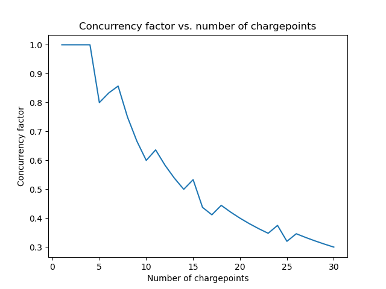

# Task 1: Logic
Assuming that your local environment has the following installed `python3` & `matplotlib`.

To run the program, in your command line, run `python3 Task_1/task_1.py`. The printed result will include:
- Total energy consumed in kWh
- The theoretical maximum power demand
- The actual maximum power demand
- The concurrency factor
- Expected output:
```
Total energy consumed: 140216.40 kWh
Theoretical maximum power demand: 220 kW
Actual maximum power demand: 88 kW
Concurrency factor: 0.40
```

## Bonus Task

- When we run the program with 1 to 30 chargepoints, the concurrency factor generally decreases as the number of chargepoints increases.
- With fewer chargepoints, demand often exceeds capacity, so chargers are used more intensively, resulting in a high concurrency factor, close to 1.
- As we add more chargepoints, the system can handle peak demand more easily, but many chargers are idle during off-peak times. This lowers the maximum observed usage relative to total capacity, reducing the concurrency factor.
- In short: the concurrency factor drops as the number of chargepoints increases, because demand doesn’t grow fast enough to keep all chargers busy at the same time.


## Daylight Saving Time (DST) vs. Mapping the hours to the 15-minute ticks
- DST introduces an irregularity: on the day we spring forward, we lose one hour (96 to 92 ticks), and on the day we fall back, we gain one hour (96 to 100 ticks). But our current simulation assumes 365 days × 96 ticks per day = 35,040 ticks, a flat, fixed tick model that ignores DST.
- Why it matters:
    - Time-of-day-dependent events (like arrival probabilities) assume each day has the same number of intervals.
    - DST breaks this uniformity, shifting arrival patterns.
    - For example:
        - DST starts: A car scheduled to arrive at 2:00 AM will never occur because that time is skipped (1:59 AM -> 3:00 AM)
        - DST ends: A car scheduled to arrive at 2:00 AM will run twice (1:59 AM -> 1:00 AM again)
