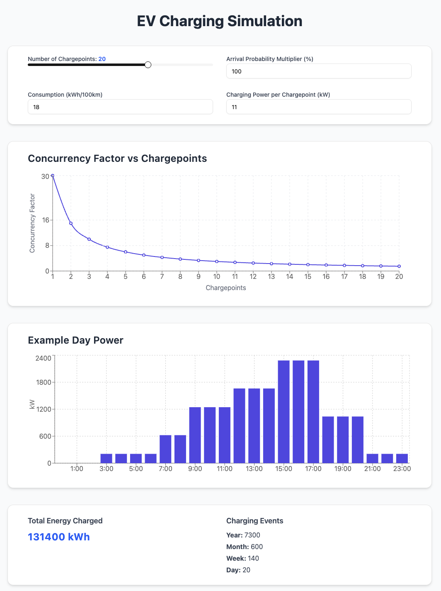

# Task 2a: Frontend
Assuming that your local environment has `npm` installed.

## Getting Started
To run the program, in your command line, run the following:
- `npm install`
- `npm run dev`

## Implementation

### Inputs
Users can interactively configure:
- **Number of chargepoints** (1–30)
- **Arrival probability multiplier** (default 100%)
- **Energy consumption per car** (kWh per 100km, default 18)
- **Charging power per chargepoint** (kW, default 11)

### Outputs

The UI displays:
- **Concurrency factor vs. number of chargepoints** (line chart)
- **Hourly charging power for an example day** (bar chart)
- **Estimated total energy charged per year** (kWh)
- **Charging event counts** (per year/month/week/day)

All outputs are dynamically recalculated based on the current input parameters.

---

## Project Structure

This project uses:
- **React**
- **TypeScript**
- **Tailwind CSS**
- **shadcn/ui**
- **Recharts**

---

## Calculations

- **Concurrency Factor**:
    - This represents how efficiently chargepoints are utilized. It is mocked for each chargepoint count from 1 to 30.
    - The values are then normalized relative to the lowest factor, assumption the lowest concurrency factor is 1 when the charging point count is 1.
    - ```concurrencyFactor = (arrivalMultiplier × consumption) / (chargepoints × chargingPower)```

- **Example Day Power**
    - Hourly power usage is calculated using provided arrival probabilities (Task 1 table), scaled by user inputs.
    - This simulates total charging demand across a 24-hour day.
    - ```totalPower = hourlyArrivalProbability × arrivalMultiplier × chargepoints × chargingPower```

- **Total Energy Charged**
    - Total energy is estimated based on one session per chargepoint per day, scaled by user inputs.
    ```
    sessionsPerDay = (arrivalMultiplier / 100) × chargepoints
    totalEnergy = sessionsPerDay × consumption (in kWh/100km) × 1.0 (assumed 100km range) × 365
    ```

- **Charging Events**
    - Estimated as the number of sessions per chargepoint, scaled over time:
    ```
    dailyEvents = (arrivalMultiplier / 100) × chargepoints 
    weekly = dailyEvents × 7  
    monthly = dailyEvents × 30  
    yearly = dailyEvents × 365
    ```
