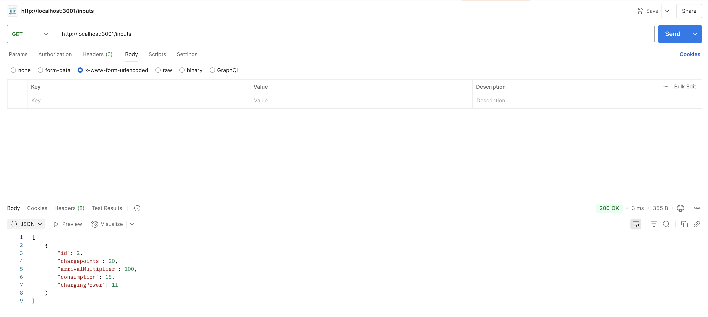
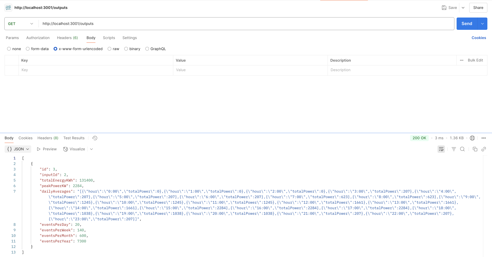

# Task 2b: Backend
Assuming that your local environment has `npm` installed.

## Getting Started
To run the program, in your command line, run the following:
- `npm install`
- `npm run dev`

## Databases
Creates two tables automatically:
- `simulation_inputs`: Stores input configurations
- `simulation_outputs`: Stores computed results, each tied to an input via `inputId`

Cascade rules are enabled:
- Updating/deleting an input will also delete its associated output(s).

---

## API Endpoints

### POST `/inputs`
Create a new simulation input.
```json
{
  "chargepoints": 20,
  "arrivalMultiplier": 100,
  "consumption": 18,
  "chargingPower": 11
}
```
**Response:** Input object with `id`.

---

### GET `/inputs`
Retrieve all stored simulation inputs.


---

### GET `/inputs/:id`
Retrieve a specific input by ID.

---

### PUT `/inputs/:id`
Update an input and automatically delete associated outputs.
```json
{
  "chargepoints": 25,
  "arrivalMultiplier": 90,
  "consumption": 17.5,
  "chargingPower": 22
}
```

---

### DELETE `/inputs/:id`
Deletes an input and all linked output records.

---

### POST `/simulate`
Run a simulation based on an input configuration.
```json
{
  "inputId": 1
}
```
**Response:** Stores and returns computed output statistics (the same calculation as the frontend task):
- `totalEnergyKWh`
- `peakPowerKW`
- `dailyAverages` (24-hour array)
- Charging events per day/week/month/year

---

### GET `/outputs`
Fetch all stored simulation results.


---

### GET `/outputs/:id`
Fetch a single simulation result by output ID.

